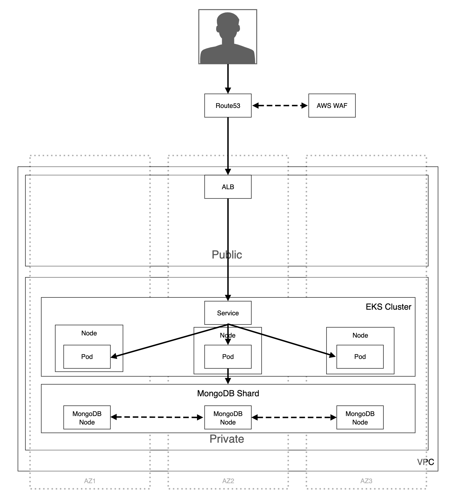

# Hello-world API

Hello-world API providing 2 features:

- Save / update a username and a date of birth
- returns hello birthday message for a given user

_Note: the application expect a mongodb instance running on default port 27017. Install & run mongo before starting the application. Additionally, you can specify a `MONGO_URL` in the `.env` configuration_

## run locally

Create a `.env` file with the following elements:

```
MONGO_URL=mongodb://localhost:27017/hello-api
PORT=3000
```

Then run:

```
npm i
npm run build
npm start
```

Access the API on http://localhost:3000/:

- GET /\_meta/health: liveness check
- GET /\_meta/ready: readiness check
- PUT /hello/:username + {dateOfBirth: 'YYYY-MM-DD'}: save/update info
- GET /hello/:username: returns hello birthday message

## development server

If you want to run the development server

```
npm i
npm start:dev
```

## Test

To run the test (make sure Mongo is running):

```
npm i
npm test
```

## Deployment

The cloud provider is AWS. The app is running on a EKS cluster.

The IaC tool is terraform, and it is used to manage the main EKS cluster (`./deploy/terraform`) amd other resources if needed.

A script has been provided to setup the aws-alb-ingress-controller.

The rest of the deployment configuration are kubernetes based file (`./deploy/kubernetes`) that can be deployed using the `kubectl apply -f ./deploy/kubernetes/` command. To deploy the infra + app:

- Verify that awscli / terraform / eksctl are installed
- Verify that your aws credentials are setup correctly (`aws configure`)
- `cd ./deploy/terraform`
- `terraform init` to initialize the workspace
- `terraform apply` then input `yes` when prompted
  - Note: you can use `terraform apply -auto-approve` to automatically approve without being prompted
- Run `aws eks --region $(terraform output -raw region) update-kubeconfig --name $(terraform output -raw cluster_name)` to setup your kubectl
- Run `sh ./deploy/aws-alb-ingress.sh` to deploy the aws-alb setup
- Finally, run `kubectl apply -f ./deploy/kubernetes/` to deploy the app

### Special note

I haven't deployed the solution for cost management and time reason. Also, it's not what i will do in a production environment. The things to keep in mind are as follow:

- MongoDB deployed as a pod => why not, but a statefulSet without Persistent volume is useless, so it's either:
  - mongodb as a set of pods with PV
  - mongodb as a SaaS service (MongoDB ATLAS)
  - mongodb as a set of EC2 in private subnet (shard with 3 nodes, 1 primary & 2 secondary and election + ASG to restart instance if one of the nodes goes down)
  - mongodb as an AWS managed services (documentDB) => preferred solution
- application tag is `latest` => not a good choice, as it will update the production for every new version of the docker image. Best solution is:
  - use `latest` for dev only
  - Tag your images in the CICD pipeline, when gates (quality, testing, security) are passed.
  - Tag to `<package_version>-rc` then deploy ('promote') to test or preprod environment
  - Tag to `<package_version>` then deploy ('promote') to prod environment
  - Basically, when deploying to production, use a 'named' version (i.e. `1.0.0`) and not a dynamic tag
- Terraform should use a `backend s3 + dynamoDB` setup to enable team work and better state + locking management
- Circleci configuration for CICD can benefits from the terraform state management to avoid running if resources (`terraform plan`) are already created + access to the output information

### Architecture diagram

The following is the infra of the project (please note that the route53 is strongly suggested but not necessary):


